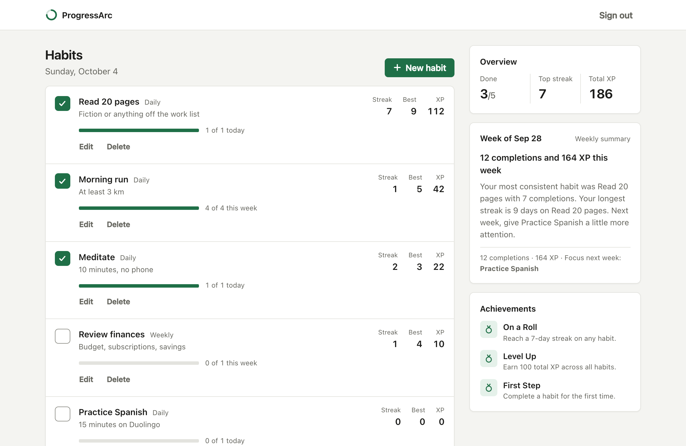
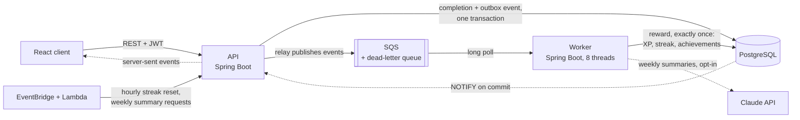

# ProgressArc

[](https://github.com/andrewwsou/progress-tracker/actions/workflows/ci.yml)
[](https://github.com/andrewwsou/progress-tracker/actions/workflows/codeql.yml)

A habit tracker with streaks, XP, achievements, and weekly summaries, built to show how an
event-driven backend stays correct under load. Completing a habit is recorded in the request;
the reward is applied by a separate worker through a queue, exactly once, even when a message is
delivered twice, out of order, or after the worker crashes.



## Highlights

- **Exactly-once rewards over at-least-once delivery.** A transactional outbox in the API and an
  idempotent consumer in the worker (a processed-event table and a per-user row lock). At 100
  completions per second, with the worker killed and the queue frozen mid-run, no request failed
  and every completion was rewarded exactly once.
- **Live updates.** Once a reward commits, the worker announces it with PostgreSQL `NOTIFY`; the
  API pushes it to the user's open tabs over server-sent events, and the page updates without
  polling.
- **Correct under contention.** 8,000 requests completing the same habit, up to 1,000 in flight
  at once, all succeeded, with one completion and one reward recorded.
- **Measured, then optimised.** A k6 harness checks the database after every run. It led to a
  window-function streak query and fewer achievement queries (77.6 ms to 6.0 ms per reward for a
  365-day streak), a set-based streak-reset job (5.1 s to 0.2 s over 20,000 habits), and a concurrent
  worker with backpressure (242 to 650 events/s).
- **Operable.** Graceful shutdown, health checks, Prometheus metrics, dead-letter queue alarms
  defined in Terraform, and Flyway migrations that both services validate against at startup.
- **An LLM feature with guardrails.** Weekly summaries written through the Claude API with
  structured output, checks that reject invented habits or numbers, a template fallback, and hard
  daily cost caps. Off unless explicitly enabled; the tests run it against a WireMock stand-in.
- **Tested in CI.** 190+ unit and integration tests (Testcontainers with PostgreSQL and an
  SQS-compatible broker), coverage gates, an OpenAPI contract check, an end-to-end Docker Compose
  run, CodeQL, and Dependabot.

Every load-test number above comes from a script in this repository; see [load/RESULTS.md](load/RESULTS.md).

## Architecture



The API never waits for the reward or for the queue: a completion and its event are written in
one transaction and the request returns. A relay publishes the event, and the worker computes
the streak, XP, and achievements. The API can also run fully synchronously, with no queue or AWS
at all, which is the default for local development.

| Part | Path | Stack |
|---|---|---|
| API | `backend/progresstracker` | Spring Boot 3.5 (Java 17), Spring Security + JWT, JPA/Hibernate, PostgreSQL, Flyway |
| Worker | `backend/progress-worker` | Spring Boot 3.5 (Java 17), AWS SQS, JPA/Hibernate, Actuator, Micrometer/Prometheus, Claude API |
| Frontend | `frontend` | React 19, TypeScript, Vite; API types generated from the OpenAPI contract |
| Infrastructure | `infra` | Terraform (SQS, dead-letter queue, alarms, EventBridge, Lambda), Python Lambda handlers |
| Load tests | `load` | k6 in Docker Compose, with SQL checks after every scenario |

## Quick start

Needs Docker; the smoke test also needs `bash`, `curl`, and `jq`, and the UI needs Node 20.19+ or 22.12+.

```
docker compose up --build --wait            # API, worker, PostgreSQL, local SQS; returns once healthy
./scripts/smoke-test.sh                     # register, complete a habit, wait for the worker's reward
cd frontend && npm install && npm run dev   # the UI on http://localhost:5173
docker compose down -v                      # stop and delete the data
```

The API listens on `http://localhost:8080` (loopback only). If that port is taken, start the
stack with `API_PORT=8081`, run the smoke test with `BASE_URL=http://localhost:8081`, and start the
UI with `VITE_API_URL=http://localhost:8081`.
Nothing in this stack talks to AWS: the queue is
[ElasticMQ](https://github.com/softwaremill/elasticmq), configured in
[`infra/local/elasticmq.conf`](infra/local/elasticmq.conf) with the same dead-letter policy as
the Terraform in `infra/terraform/sqs.tf`. The services reach it through `QUEUE_ENDPOINT_OVERRIDE`,
which is left blank in production so the AWS SDK resolves the real SQS endpoint.

## Endpoints (API)

| Method | Path | Purpose |
|---|---|---|
| POST | `/api/auth/register`, `/api/auth/login` | JWT-based auth |
| GET/POST | `/api/habits` | List the caller's habits; create one (201) |
| PUT/DELETE | `/api/habits/{id}` | Edit or delete (204) a habit the caller owns |
| POST | `/api/habits/{id}/complete` | Record a completion (sync or async, see below) |
| GET | `/api/achievements` | Unlocked achievements for the current user |
| GET | `/api/summaries/latest` | The caller's newest finished weekly summary (204 if none yet) |
| GET/PUT | `/api/me` | The caller's account: email and time zone (the browser keeps the zone current) |
| GET | `/api/events` | Live updates for the caller as server-sent events: `ready`, then `reward` and `summary` as the worker finishes them |
| POST | `/api/internal/automations/reset-streaks` | Zero out streaks for habits nobody completed recently. Auth: `X-Internal-Token` header, not JWT — meant for the scheduled Lambda in `infra/lambda`, not end users. |
| POST | `/api/internal/automations/weekly-summary` | Ask for last week's summary for every active user (optional `?weekStart=` for any other week). Same auth model. |

**Contract.** The API is described by an OpenAPI document served at `/v3/api-docs`, browsable at
`/swagger-ui.html`, and committed as [`backend/progresstracker/openapi.json`](backend/progresstracker/openapi.json).
The frontend's TypeScript types are generated from that file (`npm run generate:api`), and CI fails
if either the committed contract or the generated types drift from the running API.

**Input and errors.** Requests bind to dedicated request objects with Bean Validation, never to JPA
entities, so a client cannot set a habit's id, owner, XP, or streak. Errors from the controllers, validation,
and authentication are [RFC 9457](https://www.rfc-editor.org/rfc/rfc9457) problem documents
(`application/problem+json`); validation failures list a message per field under `errors`. A missing or invalid token is `401`,
acting on someone else's habit is `403`, and an unknown habit is `404`.

## Async completion pipeline

`POST /api/habits/{id}/complete` behaves differently depending on `queue.enabled`:

- **`queue.enabled=false`** (default local dev): streak, XP, and achievement unlocks are computed
  inline and returned in the response.
- **`queue.enabled=true`**: the API writes a zero-XP completion row and an event describing it
  (`{eventId, userId, habitId, date, occurredAt}`) in one database transaction, then returns
  immediately. A relay publishes the event to SQS. The worker long-polls SQS, computes
  streak/XP/achievement state, persists it, and queues a completion email. The reward is
  therefore eventually consistent: the response shows the completion, and the XP, streak, and
  any achievement appear after the relay's next run (`OUTBOX_RELAY_DELAY_MS`, default 500 ms)
  plus queue and worker time.

**Reliability:** the pipeline applies each completion's reward **exactly once**, even though the
queue only promises at-least-once, unordered delivery.
- **No lost events (transactional outbox).** Writing to the database and then sending to a queue
  are two separate systems; if the send fails after the commit, the reward is lost. So the API
  never sends on the request path. The event goes into an `outbox_events` table in the same
  transaction as the completion, and [`OutboxRelay`](backend/progresstracker/src/main/java/com/progresstracker/progresstracker/outbox/OutboxRelay.java)
  publishes unpublished rows on a timer (`FOR UPDATE SKIP LOCKED`, so several API instances can
  relay at once). If the queue is down or the API restarts mid-send, the row is simply still
  there for the next run. A request that loses the unique-constraint race fails on the
  completion row before it writes an event, so there is exactly one event per completion.
  The relay only runs in async mode: before switching `QUEUE_ENABLED` to false, wait until
  `select count(*) from outbox_events where published_at is null` returns 0.
- **No double rewards (idempotent consumer).** The worker records each event id in a
  `processed_events` table in the same transaction as the reward, so a redelivered message is
  recognised and ignored. Then, holding a row lock on the user, it rewards a completion only if
  that completion has no XP yet. That check is what guarantees one reward per completion, even
  if the same completion arrives as two different events. If processing fails, everything rolls
  back, including the event id, and the redelivery tries again.
- **No lost updates.** The user lock makes reward transactions for one user run one at a time,
  so two workers cannot overwrite each other's totals. The API and the worker write different
  columns of the same habit row, and each updates only the columns it changed, so an edit
  cannot erase a reward or the other way round. The worker writes the reward columns in one
  `UPDATE` computed from the row as it is at that moment, so the streak reset running
  mid-reward cannot leave a just-completed habit with a zero streak
  ([`StreakResetRaceIT`](backend/progress-worker/src/test/java/com/progresstracker/progressworker/integration/StreakResetRaceIT.java)
  forces that interleaving; the earlier read-modify-write failed it). The synchronous path closes
  the same race the other way: it locks the habit's row and reads it again inside the transaction
  before computing the streak ([`CompletionDuringStreakResetIT`](backend/progresstracker/src/test/java/com/progresstracker/progresstracker/integration/CompletionDuringStreakResetIT.java)). Achievement unlocks are inserts that do nothing
  on conflict, so racing unlocks cannot fail.
- **Order does not matter.** The current streak only moves forward and the 7-day-streak
  achievement is judged on the longest streak, so an older event arriving late (a retry, or a
  redrive from the dead-letter queue) gives the same result as arriving on time.
- The poller distinguishes **poison messages** (malformed payload — deleted immediately, retrying
  can't help) from **transient processing failures** (left on the queue so SQS redelivers after
  the visibility timeout; safe because processing is idempotent). A message that fails 5 times
  moves to the **dead-letter queue**, and a CloudWatch alarm fires as soon as one is there.

**Each user's own calendar.** A completion, a goal, and a streak all count in the user's own days:
a habit done at 8 pm in Los Angeles belongs to that day, though it is already tomorrow in UTC.
The browser sends its IANA time zone at sign-up and keeps it current (`PUT /api/me`); the API
works out "today" from one injectable `Clock` and that zone
([`UserCalendar`](backend/progresstracker/src/main/java/com/progresstracker/progresstracker/service/UserCalendar.java)).
The streak reset stays one `UPDATE` and lets PostgreSQL compute every owner's local date
(`now AT TIME ZONE u.time_zone`), so it now runs hourly and reaches each zone within an hour of its
midnight. The column came in as the second Flyway migration; existing users kept UTC, which is
what the server had used for them. A completion keeps the date it had in the zone where it was made. So after
moving west, a habit can already be done "tomorrow" (it counts as done, and its streak never moves
backwards); after moving east, a streak kept every day can lose one day.

**Live updates.** When a reward (or a weekly summary) has committed, the worker runs
`pg_notify('habit_events', ...)`, so a browser is never told about a reward that did not happen.
It runs just after the commit rather than inside the reward transaction: a transaction that sends
`NOTIFY` holds a database-wide lock while it commits, and inside the reward transaction that lock
made the eight worker threads' commits queue behind each other (see load/RESULTS.md section 7).
The cost is that a crash between commit and notify loses one notification, which is only a hint. Each API instance holds one `LISTEN` connection outside the pool and
forwards an event to the open streams of the user it names
([`PostgresEventListener`](backend/progresstracker/src/main/java/com/progresstracker/progresstracker/events/PostgresEventListener.java),
[`UserEventStreams`](backend/progresstracker/src/main/java/com/progresstracker/progresstracker/events/UserEventStreams.java)).
An event only says "something changed"; the page then reads the new state through the normal
endpoints, so a missed event costs a moment of staleness, never wrong data, and the page also
refreshes whenever its stream reconnects. The browser reads the stream with `fetch` because
`EventSource` cannot send the `Authorization` header. Because notifications sent while nobody
listens are lost, the listener tells every open stream to re-read after each reconnect, and it
checks its connection every 30 seconds so a database that vanished without closing it is noticed.
A user keeps at most five streams (opening a sixth closes the oldest), a hidden tab drops its
stream and catches up when shown again, and the client reconnects with backoff if the stream goes
silent. On shutdown the streams are closed before the web server's graceful shutdown, which would
otherwise wait out its timeout for streams that never end.

**The worker under load and in operation.**
- **Bounded concurrency with backpressure.** Messages are processed by a fixed pool of 8 threads
  (`WORKER_CONCURRENCY`). The poller only asks SQS for as many messages as there are idle threads,
  so a received message never waits in memory while its visibility timeout runs out. One user's
  rewards still apply one at a time (the row lock), so a slow or stuck user no longer holds up
  everyone else. Startup fails if the threads could exhaust the database pool (`DB_POOL_SIZE` − 2).
- **Graceful shutdown.** On SIGTERM the worker stops polling, lets the messages in flight finish
  (up to 25 s), and only then closes its queue client and database pool. Anything still running
  at the deadline is simply redelivered. A failing queue is retried with exponential backoff.
- **Health and metrics.** `/actuator/health` (Docker `HEALTHCHECK`, and a liveness group that
  fails if the poll loop dies or stalls) and `/actuator/prometheus` on port 8081, which Compose
  does not publish. Metrics: events by outcome (`worker_events_total{outcome=applied|skipped|invalid|failed}`),
  processing time and end-to-end lag as histograms, messages in flight, and poll errors.
- **Alarms** ([`infra/terraform/sqs.tf`](infra/terraform/sqs.tf)): any message in the dead-letter
  queue, and an oldest message older than 5 minutes (the worker is down or falling behind).
- The sync path (`HabitController`) has its own concurrency edge case: two requests completing the
  same habit at once can both pass the "already completed?" check before either commits, so the
  loser hits the DB's `(habit_id, completed_date)` unique constraint. Found via a concurrent load
  test (50 parallel requests against one habit — 9 failed with a 500 before the fix), fixed by
  treating that constraint violation as "lost the race, return current state" instead of an error.
  Covered by [`HabitControllerTest`](backend/progresstracker/src/test/java/com/progresstracker/progresstracker/controller/HabitControllerTest.java);
  100 concurrent completions across 100 distinct habits sustained 100% success at p95 ≈ 195ms.

**Measured impact:** instrumented both code paths with request-level timing
(`COMPLETION_LATENCY` log lines in `HabitController`) and measured 20 completions per mode
locally against real Postgres:

| Mode | Avg latency |
|---|---|
| Sync (`queue.enabled=false`) | ~12.0ms |
| Async (`queue.enabled=true`) | ~4.5ms |

**~63% reduction**, driven by moving the ~10-query achievement-evaluation pass off the request
thread. The transactional outbox added later puts one more insert in the async request's
transaction; measured before and after that change, the async figure did not move.

## Running locally

Requires Postgres 14+, Java 17, and Node 20.19+ (or 22.12+).

1. **Database**
   ```
   createuser ptrack --pwprompt   # password: ptrack
   createdb progresstracker -O ptrack
   ```
2. **API** (from `backend/progresstracker`). It creates the schema on startup, so start it before the worker.
   ```
   export JWT_SECRET=$(openssl rand -base64 48)
   ./mvnw spring-boot:run
   ```
   Runs fully synchronously by default — no AWS credentials needed. The API refuses to start
   without a `JWT_SECRET` of at least 32 bytes. To exercise the async path against a real SQS
   queue, set `QUEUE_ENABLED=true`, `QUEUE_SQS_URL`, and AWS credentials.
3. **Worker** (from `backend/progress-worker`, only needed in async mode)
   ```
   QUEUE_ENABLED=true QUEUE_SQS_URL=<queue url> ../progresstracker/mvnw -f pom.xml spring-boot:run
   ```
   With `QUEUE_ENABLED` unset the worker starts but does not poll.
4. **Frontend** (from `frontend`)
   ```
   npm install && npm run dev
   ```
   Serves on `http://localhost:5173` and calls the API at `http://localhost:8080`; set
   `VITE_API_URL` to point it elsewhere.

**Configuration.** No secrets live in the repo. Every deployment-specific value (JWT secret,
database credentials, queue URL, automation token) is an environment variable with a
local-dev default where one is safe; [`.env.example`](.env.example) lists them all.

## Database schema

The schema is defined by versioned SQL migrations in
[`backend/progresstracker/src/main/resources/db/migration`](backend/progresstracker/src/main/resources/db/migration),
which the API applies with [Flyway](https://flywaydb.org/) when it starts. Both services run
Hibernate with `ddl-auto=validate`: they never change the schema, and they refuse to start if
their entities no longer match it. That matters here because the API and the worker each keep
their own copies of the shared entities; a column one side renames without a migration now fails
at startup (and in every integration test) instead of silently creating a second column. The
worker's tests build their database from the same migration files.

`V1__baseline.sql` is the schema Hibernate used to create, checked column by column against a
database it created. A local database from before migrations is adopted as V1 automatically.
To change the schema, add the next `V<n>__description.sql`; never edit one that has been applied.

## Tests

Run from the repository root:

```
# Unit tests only: fast, no Docker or database needed
(cd backend/progresstracker && ./mvnw test)
(cd backend/progress-worker && ../progresstracker/mvnw test)

# Unit + integration tests + coverage gate: needs Docker running
(cd backend/progresstracker && ./mvnw clean verify)
(cd backend/progress-worker && ../progresstracker/mvnw clean verify)
```

**Unit tests** (`*Test`, Mockito) cover streak/XP calculation, goal-period no-ops, JWT handling,
the scheduled automations, and idempotent message processing. `SqsPollerTest` runs the poller
against a fake queue: it never holds more messages than idle threads, a stop lets the messages in
flight finish before the client closes, a message still running at the deadline is left for
redelivery, and failed polls back off.

**Integration tests** (`*IT`, [Testcontainers](https://testcontainers.com/)) start a real
PostgreSQL and an SQS-compatible broker in Docker and run the actual services against them:

| Test | What it proves |
|---|---|
| [`HabitCompletionConcurrencyIT`](backend/progresstracker/src/test/java/com/progresstracker/progresstracker/integration/HabitCompletionConcurrencyIT.java) | 50 simultaneous completions of one habit over HTTP all return 200, write exactly one row, and grant XP once. This is the race described above, and it needs a real database: a mock cannot violate a unique constraint. |
| [`HabitAccessControlIT`](backend/progresstracker/src/test/java/com/progresstracker/progresstracker/integration/HabitAccessControlIT.java) | A create request carrying another user's habit id, or its own XP, cannot take over that habit or grant itself a reward. Users only see their own habits and get 403 on anyone else's; requests without a valid token get 401. |
| [`RequestValidationIT`](backend/progresstracker/src/test/java/com/progresstracker/progresstracker/integration/RequestValidationIT.java) | Blank names, out-of-range goals, unknown enum values, malformed JSON, bad emails, and short passwords are refused with a problem document and write nothing. |
| [`OpenApiContractIT`](backend/progresstracker/src/test/java/com/progresstracker/progresstracker/integration/OpenApiContractIT.java) | The committed `openapi.json` matches what the running API serves. |
| [`CompletionOutboxIT`](backend/progresstracker/src/test/java/com/progresstracker/progresstracker/integration/CompletionOutboxIT.java) | The completion and its event are written together and the relay publishes the event; if the event cannot be written, the completion is rolled back with it; 20 simultaneous completions leave exactly one event; an event written while the queue is down is delivered once it is back. |
| [`OutboxRelayIT`](backend/progresstracker/src/test/java/com/progresstracker/progresstracker/integration/OutboxRelayIT.java) | A relay skips rows another relay has locked instead of waiting for them; six relays released together publish each of 30 events exactly once; the purge removes old published events and never an unpublished one. |
| [`CompletionPipelineIT`](backend/progress-worker/src/test/java/com/progresstracker/progressworker/integration/CompletionPipelineIT.java) | The worker grants XP, streaks, and achievements from a queued event; duplicate deliveries grant the reward once; malformed messages are deleted; a failure mid-processing rolls back and the redelivery succeeds; a message that always fails moves to the dead-letter queue after 5 attempts; a user whose reward is stuck on a lock does not hold up another user's (this fails with one thread); health and metrics report the worker. |
| [`HabitEventNotifierIT`](backend/progress-worker/src/test/java/com/progresstracker/progressworker/integration/HabitEventNotifierIT.java) | A reward applied from the queue notifies the API once it has committed; a notification sent in a transaction that rolls back is never delivered. |
| [`EventStreamIT`](backend/progresstracker/src/test/java/com/progresstracker/progresstracker/integration/EventStreamIT.java) | A notification reaches the open event stream of the user it names and no one else's; the stream needs a login. |
| [`StreakResetRaceIT`](backend/progress-worker/src/test/java/com/progresstracker/progressworker/integration/StreakResetRaceIT.java) | The streak reset committing in the middle of a reward cannot leave the just-completed habit with a zero streak. The test forces the interleaving with a second connection; the previous code failed it. |
| [`ConcurrentProcessingIT`](backend/progress-worker/src/test/java/com/progresstracker/progressworker/integration/ConcurrentProcessingIT.java) | Several workers at once: the same event handled twice rewards and emails once; two days of one habit handled together lose no XP; different habits of one new user unlock the first achievement once. All of these failed before the event-id table and the per-user lock. Also: an older day handled late still earns its streak without rewinding the current one, and a reward does not undo an edit made meanwhile. |
| [`StreakQueryIT`](backend/progress-worker/src/test/java/com/progresstracker/progressworker/integration/StreakQueryIT.java) | The single-query streak calculation gives the same answer as counting back one day (or week) at a time, on 120 random completion histories, including across a year boundary. |
| [`AchievementUnlockIT`](backend/progress-worker/src/test/java/com/progresstracker/progressworker/integration/AchievementUnlockIT.java) | The XP achievement unlocks when a user's total across habits reaches 100, the streak achievement on the seventh day in a row, and each only once. |
| [`StreakResetIT`](backend/progresstracker/src/test/java/com/progresstracker/progresstracker/integration/StreakResetIT.java) | The streak reset, a single UPDATE, zeroes exactly the streaks that have lapsed and changes nothing else; the day and week boundaries fall in the right place (including ISO week 53); the same history lapses for an owner on Kiritimati (UTC+14) but not for one in Los Angeles. |
| [`TimeZoneIT`](backend/progresstracker/src/test/java/com/progresstracker/progresstracker/integration/TimeZoneIT.java) | With the clock fixed at 02:30 UTC, a completion counts for 4 October in Los Angeles and 5 October in UTC; moving the account to another zone moves its "today"; unknown zones are refused. |
| [`CompletionDuringStreakResetIT`](backend/progresstracker/src/test/java/com/progresstracker/progresstracker/integration/CompletionDuringStreakResetIT.java) | In sync mode, the streak reset committing in the middle of a completion cannot leave the habit with a zero streak. Forced with a second connection; the previous code failed it. |
| [`WeeklySummaryIT`](backend/progresstracker/src/test/java/com/progresstracker/progresstracker/integration/WeeklySummaryIT.java) | The weekly job needs the internal token, asks once per active user (a repeated run adds nothing), and users read only their own newest finished summary. |
| [`WeeklySummaryJobIT`](backend/progress-worker/src/test/java/com/progresstracker/progressworker/integration/WeeklySummaryJobIT.java) | The worker against WireMock standing in for the Claude API: a summary is written and its cost recorded; timeouts and server errors are retried and then fall back to the template; refusals, invented habits, and invented numbers fall back too; the daily token budget stops calls; expired claims are taken over; a stale worker cannot overwrite a newer claim; two workers write each summary once. |

**End-to-end**: `scripts/smoke-test.sh` drives the Docker Compose stack over HTTP and waits for
the worker's reward to appear, then asks for this week's summary and waits for the worker to
write it, covering both paths between the two services.

**CI** ([`.github/workflows/ci.yml`](.github/workflows/ci.yml)) runs all of the above on every
pull request and every push to `main`, along with a JaCoCo line-coverage gate, the frontend lint, build, and generated-types check, and
`terraform validate`.
[CodeQL](.github/workflows/codeql.yml) scans the Java, TypeScript, and Python code and the workflows
themselves for security bugs on every pull request and weekly, and
[Dependabot](.github/dependabot.yml) opens weekly pull requests for minor and patch dependency
updates (Maven, npm, GitHub Actions, Terraform providers), which CI then checks.

## Load tests

[`load/run.sh`](load/run.sh) drives the Docker Compose stack with [k6](https://k6.io/) and then
checks the database for what the pipeline promises: every completion rewarded, exactly once.
How to run it is in [`load/README.md`](load/README.md); recorded numbers are in
[`load/RESULTS.md`](load/RESULTS.md). On one laptop:

- **Contention.** 8,000 requests completing the same habit, 200 and then 1,000 in flight at a
  time: all 8,000 succeeded, with one completion and one reward recorded.
- **Failures under load.** At 100 completions per second, the worker was killed and the queue
  frozen mid-run. No request failed, and afterwards every completion had been rewarded exactly once.
- **Sync versus async.** At the same request rate, async mode lowered average completion latency
  by 43 to 55% and p99 by 73 to 95% across three runs.
- **Optimisations it led to.** The worker's time to apply a reward went from 14.2 ms to 7.7 ms
  for a one-day streak and from 77.6 ms to 6.0 ms for a 365-day streak (one window-function query
  for the streak, and about ten achievement queries cut to three). The streak reset over
  20,000 habits went from 5.1 s to 0.2 s (one UPDATE instead of 20,000).
- **Worker concurrency.** Clearing a backlog of 6,000 queued events, the worker went from
  242 events/s with one thread to 650 events/s with eight (median of three alternating runs,
  about 2.7 times), with every completion still rewarded exactly once.

## Weekly summaries (Claude)

Every week each active user gets a short summary of their week, written by Claude, shown at the
top of the app, and queued as an email.

```
 EventBridge (weekly) -> Lambda -> POST /api/internal/automations/weekly-summary
      -> one PENDING row per active user in weekly_summaries (one INSERT ... SELECT, repeats ignored)
 worker timer -> claim rows (FOR UPDATE SKIP LOCKED, with a lease) -> read the user's week (one query)
      -> Claude writes it (structured output) -> validate it -> READY        -> GET /api/summaries/latest
                         \-> any failure -> template writes it instead -/
```

**Why the work is split this way.** A model call takes seconds. The API only records the requests,
so the scheduled job returns at once. The worker writes the summaries on its own timer thread,
so a slow model call never delays the queue poller that applies rewards.

**Guardrails.**
- **Structured output.** The answer is constrained to a JSON schema (`headline`, `body`,
  `focusHabit`), so it always parses.
- **Validated against the data.** The focus habit must be one of the user's habits, spelled
  exactly, and every number in the text must appear in the data. A summary that invents a habit or
  a statistic is never shown.
- **Off unless switched on.** The worker makes no Claude calls unless `SUMMARY_LLM_ENABLED=true`
  *and* `ANTHROPIC_API_KEY` are both set, and the model is Opus 5.5 or Sonnet 5.5. A key that is
  merely present in your shell does nothing. Tests, CI, and the load harness pin it off.
- **Hard daily caps.** At most 10 API requests and 100,000 tokens per UTC day, across all
  workers (`summary.llm.max-calls-per-day`, `daily-token-budget`). Each call is reserved before
  it is sent, at its worst case (prompt size plus the output cap, doubled if a fallback model may
  re-run it), in one atomic `INSERT ... ON CONFLICT DO UPDATE ... WHERE` on a per-day row, and
  never refunded, so timeouts, errors, and two workers racing all count. A week with more than
  20 habits or a prompt over 8 KB goes to the template. Worst case with the defaults: about
  $1.25 a day at Opus 5.5 prices ($4/$20 per million tokens); a weekly summary for one user costs
  about a cent. Setting the call cap to 0 stops every call.
- **Always a summary.** Claude off, a cap reached, a timeout, a server error, a refusal, a
  truncated answer, a failed validation, or an unexpected error: in every case a
  deterministic template writes the summary instead, and the reason is stored with it
  (`fallback_reason`). API errors are also logged with the API's message.
- **Bounded time.** Low effort, a cap of 2,048 output tokens, and a 30-second timeout with no
  retries (a failed call means a template summary, not another paid attempt). Tokens (summed over
  every attempt when a fallback model answered), latency, and the model that answered are stored
  on every row, and the day's recorded tokens are checked against the budget too.
- **Refusal fallback.** Requests opt into server-side fallbacks (`fallbacks: "default"`): if the
  model declines, the API re-runs the request on Anthropic's recommended fallback model.
- **Safe to run on several workers.** Rows are claimed in batches with `FOR UPDATE SKIP LOCKED`
  and a lease, and each row's lease is renewed just before its summary is written, so a slow
  batch is not claimed twice. A worker that crashes leaves its claim to expire, and another takes
  the row over. The claim's attempt number works as a fencing token, so a worker that stalled past
  its lease cannot overwrite the newer copy. After 3 attempts a row is marked FAILED; asking for
  that week again queues it once more.
- **Privacy and prompt injection.** Only habit names and numbers are sent, never the user's email.
  Habit names are user-written text, so the week goes in a tagged JSON block and the prompt says
  to treat names as data. Whatever comes back still has to pass validation.

**Running it.** Set both `SUMMARY_LLM_ENABLED=true` and `ANTHROPIC_API_KEY` for the worker (see
`.env.example`); otherwise every summary comes from the template and nothing is sent. The model
is `claude-opus-5-5` by default (`SUMMARY_LLM_MODEL=claude-sonnet-5-5` is cheaper). Locally, the smoke test asks for this week's summaries; you can too. A week is
summarized once, so a summary of the current week covers only the days so far:

```
curl -X POST -H "X-Internal-Token: local-development-only-token" \
  "http://localhost:8080/api/internal/automations/weekly-summary?weekStart=$(date -u +%F)"
```

**Tests** run without a key: unit tests cover the validator, the template, and every branch of
the AI-or-template decision, and `WeeklySummaryJobIT` runs the real Claude SDK against WireMock
for success, timeout and retry, server errors, refusals, fallback token counts, invented output,
the budget, a backlog, and claims (leases, renewal, fencing, two workers at once).

## Scheduled automations (infra/)

Two batch jobs that don't belong on the request path:

- **Hourly streak reset** — a habit's `currentStreak` is normally only recalculated on its next
  completion, so a habit a user abandoned keeps showing a stale streak indefinitely. This job
  zeroes it out once the gap is long enough on the owner's own calendar (`StreakResetService`),
  in a single UPDATE; running hourly reaches every time zone within an hour of its midnight.
- **Weekly summary** — asks for each active user's summary of the past week
  (`WeeklySummaryService`); the worker writes them (see "Weekly summaries" above).

Both are implemented as service logic in the API (tested with no AWS needed —
`StreakResetServiceTest`, `StreakResetIT`, `WeeklySummaryIT`) behind internal endpoints, plus a thin
invocation layer meant to run on AWS:

- `infra/lambda/` — stdlib-only Python handlers that POST to the internal endpoints. Verified
  locally by invoking them as plain Python functions against a running API instance (see git
  history) — real behavior, not just read-through.
- `infra/terraform/` — EventBridge schedules, the two Lambda functions, a minimal logs-only IAM
  role, an SQS dead-letter queue + redrive policy for the completion queue, and CloudWatch alarms
  on the dead-letter queue and on the age of the oldest message (`alarm_topic_arn` to notify an
  SNS topic). Runs clean through
  `terraform init` and `terraform validate` with no AWS credentials. **Not applied** — `terraform
  plan`/`apply` need a real AWS account and haven't been run, so treat this as reviewed,
  syntactically-valid IaC rather than verified infrastructure.

## Roadmap (not yet built)

- Deploying the Terraform (`terraform apply`) against a real AWS account
- Full AWS deployment for the app itself (RDS, ECS Fargate behind ALB, S3/CloudFront for the frontend, SSM for config)
- A dashboard for the worker's Prometheus metrics (they are exported; nothing scrapes them yet)
