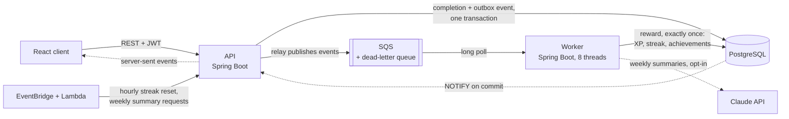

# ProgressArc

[](https://github.com/andrewwsou/progress-tracker/actions/workflows/ci.yml)
[](https://github.com/andrewwsou/progress-tracker/actions/workflows/codeql.yml)

A habit tracker with streaks, XP, achievements, and weekly summaries, built to show how an
event-driven backend stays correct under load. Completing a habit is recorded in the request; a
separate worker applies the reward through a queue, exactly once, even when a message is
delivered twice, out of order, or after a crash.

**Stack:** Java 17, Spring Boot 4.1, PostgreSQL, SQS, React 19 with TypeScript, Terraform, Docker Compose.


## Highlights

- **Exactly-once rewards.** A transactional outbox and an idempotent consumer. With the worker
  killed and the queue frozen mid-run at 100 requests per second, no request failed and every
  completion was rewarded exactly once.
- **Correct under contention.** 8,000 requests completing the same habit, up to 1,000 in flight
  at once, all succeeded, with one completion and one reward recorded.
- **Measured, then optimised.** A k6 harness checks the database after every run. It led to a 92%
  cut in reward time for long streaks, a streak reset that went from 5.1 s to 0.2 s, and a worker
  that clears a backlog 3.4 times faster on eight threads.
- **Live updates.** Rewards reach open browser tabs through PostgreSQL `NOTIFY` and server-sent
  events, with no polling.
- **Hardened sign-in.** Failed sign-ins are throttled (`429` with `Retry-After`), signing out
  revokes every token the user holds, and users cannot see or change each other's habits.
- **An LLM feature with guardrails.** Weekly summaries through the Claude API with structured
  output, validation against the week's data, a template fallback, and hard daily cost caps. Off
  unless explicitly enabled.
- **Tested in CI.** 290+ backend tests against real PostgreSQL and an SQS-compatible broker
  (Testcontainers), 60 frontend tests, coverage gates, an OpenAPI contract check, and an
  end-to-end Docker Compose run.

Every number comes from a script in this repository, run on one laptop: [load/RESULTS.md](load/RESULTS.md).

## Architecture



The API never waits for the reward or for the queue: a completion and its event are written in
one transaction and the request returns. A relay publishes the event, and the worker computes
the streak, XP, and achievements. The API can also run fully synchronously, with no queue at all.

| Part | Path | Stack |
|---|---|---|
| API | `backend/progresstracker` | Spring Boot, Spring Security + JWT, JPA/Hibernate, Flyway |
| Worker | `backend/progress-worker` | Spring Boot, AWS SQS, Actuator, Micrometer/Prometheus, Claude API |
| Frontend | `frontend` | React, TypeScript, Vite; API types generated from the OpenAPI contract |
| Infrastructure | `infra` | Terraform (SQS, dead-letter queue, alarms, EventBridge, Lambda), Python Lambda handlers |
| Load tests | `load` | k6 in Docker Compose, with SQL checks after every scenario |

## Quick start

Needs Docker. The smoke test also needs `bash`, `curl`, and `jq`; the UI needs Node 22.13+ or 24+.

```
docker compose up --build --wait            # API, worker, PostgreSQL, local SQS; returns once healthy
./scripts/smoke-test.sh                     # register, complete a habit, wait for the worker's reward
cd frontend && npm install && npm run dev   # the UI on http://localhost:5173
docker compose down -v                      # stop and delete the data
```

The API listens on `http://localhost:8080`. Nothing in this stack talks to AWS: the queue is
[ElasticMQ](https://github.com/softwaremill/elasticmq), an SQS-compatible broker. To run the
services without Docker, or on another port, see [docs/DEVELOPMENT.md](docs/DEVELOPMENT.md).

## How it works

- **No lost events.** The completion and its event are written in one database transaction (a
  transactional outbox). A relay publishes the event afterwards, so a queue outage only delays it.
- **No double rewards.** The worker records each event id in the same transaction as the reward
  and, holding a row lock on the user, rewards a completion only if it has no XP yet. A
  redelivered or duplicated message changes nothing.
- **Failures are contained.** Malformed messages are deleted, failed ones are redelivered, and a
  message that fails 5 times moves to a dead-letter queue.
- **Two modes, one result.** With `QUEUE_ENABLED=false` the API computes the reward inline, taking
  the same locks and running the same streak queries as the worker.
- **Live updates.** After a reward commits, the worker sends a PostgreSQL `NOTIFY`; each API
  instance forwards it to that user's open streams. An event only says "re-read", so a missed one
  costs a moment of staleness, never wrong data.
- **Each user's own calendar.** Days and weeks count in the user's time zone. The hourly streak
  reset is one `UPDATE` in which PostgreSQL works out each owner's local date.
- **Sign-in.** Emails are case-insensitive. Failed sign-ins are limited per email and per client
  address within 15 minutes. Signing out raises the user's token version, which revokes every
  token and closes their open streams.
- **Operations.** A bounded worker pool with backpressure, graceful shutdown, health checks,
  Prometheus metrics, and Flyway migrations that both services validate against at startup.

The reasoning, trade-offs, and edge cases are in [docs/DESIGN.md](docs/DESIGN.md).

## API

| Method | Path | Purpose |
|---|---|---|
| POST | `/api/auth/register`, `/login`, `/logout` | JWT auth; logout signs the user out everywhere |
| GET/POST | `/api/habits` | List the caller's habits; create one |
| PUT/DELETE | `/api/habits/{id}` | Edit or delete a habit the caller owns |
| POST | `/api/habits/{id}/complete` | Record a completion |
| GET | `/api/achievements`, `/api/summaries/latest` | Unlocked achievements; the newest weekly summary |
| GET/PUT | `/api/me` | The caller's email and time zone |
| GET | `/api/events` | Live updates as server-sent events |
| POST | `/api/internal/automations/*` | Scheduled jobs (streak reset, weekly summaries), behind an internal token |

The API is described by an OpenAPI document (`/v3/api-docs`, `/swagger-ui.html`, and the committed
[`openapi.json`](backend/progresstracker/openapi.json)). The frontend's TypeScript types are
generated from it, and CI fails if either drifts from the running API. Errors are
[RFC 9457](https://www.rfc-editor.org/rfc/rfc9457) problem documents.

## Weekly summaries (Claude)

Each week every active user gets a short summary of their week, written by Claude when it is
switched on and by a template when it is off or anything fails. The answer is constrained to a
JSON schema and checked against the week's data before it is shown. The worker makes no Claude
calls unless `SUMMARY_LLM_ENABLED=true` and `ANTHROPIC_API_KEY` are both set, and then at most 10
calls and 100,000 tokens a day. Tests run it against a WireMock stand-in, never the real API.
Details: [docs/DESIGN.md](docs/DESIGN.md#weekly-summaries-claude).

## Tests

```
# Unit tests only: fast, no Docker needed
(cd backend/progresstracker && ./mvnw test)
(cd backend/progress-worker && ../progresstracker/mvnw test)

# Unit + integration tests + coverage gate: needs Docker running
(cd backend/progresstracker && ./mvnw clean verify)
(cd backend/progress-worker && ../progresstracker/mvnw clean verify)

# Frontend and the Lambda handlers
(cd frontend && npm install && npm test)
python3 -m unittest discover -s infra/lambda -p "test_*.py"
```

Integration tests start a real PostgreSQL and an SQS-compatible broker with
[Testcontainers](https://testcontainers.com/) and run the actual services against them. CI runs
everything on every pull request with coverage gates, alongside CodeQL scans and Dependabot
updates. What each test proves is listed in [docs/TESTING.md](docs/TESTING.md).

## Load test results

[`load/run.sh`](load/run.sh) drives the Docker Compose stack with [k6](https://k6.io/) and then
checks the database for what the pipeline promises. On one laptop:

| Scenario | Result |
|---|---|
| Contention | 8,000 requests on one habit, up to 1,000 in flight: all succeeded, one completion and one reward recorded |
| Failures under load | Worker killed and queue frozen at 100 requests/s: no request failed, every completion rewarded exactly once |
| Sync versus async | Async lowered average completion latency by 43 to 55% and p99 by 73 to 95% (an earlier 20-request measurement: 12.0 ms to 4.5 ms on average, about 63%) |
| Reward time | 77.6 ms to 6.0 ms for a 365-day streak, after one window-function query replaced a per-day loop |
| Streak reset | 5.1 s to 0.2 s over 20,000 habits, after one `UPDATE` replaced 20,000 |
| Worker throughput | 204 to 685 events/s, one thread versus eight |

Full numbers and how to reproduce them: [load/RESULTS.md](load/RESULTS.md) and [load/README.md](load/README.md).

## Infrastructure

Terraform in [`infra/terraform`](infra/terraform) defines the SQS queue, its dead-letter queue,
CloudWatch alarms, and the EventBridge schedules and Lambdas that trigger the hourly streak reset
and the weekly summaries. CI runs `terraform validate` and tests the Lambda handlers. It has not
been applied to a real AWS account.

## Roadmap

- Deploy to AWS (the Terraform above, plus RDS, ECS, and a CDN for the frontend)
- A dashboard for the worker's Prometheus metrics
- Email delivery (completion and weekly-summary notices are only logged today)

## More

- [docs/DESIGN.md](docs/DESIGN.md): how each part works and why
- [docs/TESTING.md](docs/TESTING.md): what the tests cover
- [docs/DEVELOPMENT.md](docs/DEVELOPMENT.md): running the services without Docker
- [load/README.md](load/README.md) and [frontend/README.md](frontend/README.md)
